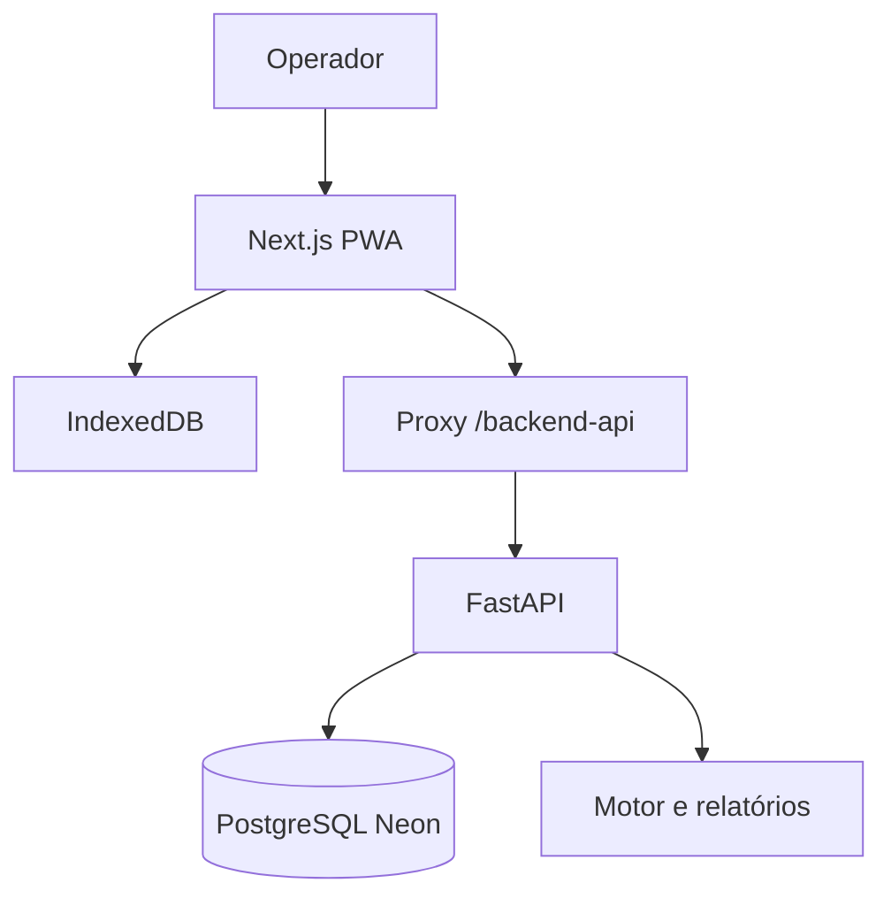

# Arquitetura

## Visão geral

O INVENTÁRIO combina uma aplicação PWA offline-first com uma API central. O dispositivo conclui a operação local antes de tentar comunicação remota. O backend adiciona colaboração, autorização, histórico, análise consolidada e exportações.

## Fronteiras

| Camada | Diretórios | Responsabilidade | Não deve fazer |
|---|---|---|---|
| Rotas | `app/` | Compor páginas e layout | Concentrar regra de negócio |
| Interface | `components/` | Estado visual e interação | Persistir diretamente no PostgreSQL |
| Cliente local | `lib/` | IndexedDB, modelos e clientes HTTP | Recalcular relatório oficial |
| Contrato HTTP | `backend/app/main.py`, `schemas.py` | Validar requisições e expor endpoints | Alterar migrations em runtime |
| Serviços | `auth_service.py`, `sync_service.py`, `share_service.py` | Regras específicas de autenticação, sync e links | Renderizar UI |
| Motor | `engine.py` | Classificação determinística | Depender de HTTP ou banco |
| Relatórios | `reports.py` | Modelo consolidado e exportações | Criar regras paralelas de classificação |
| Persistência | `database.py`, `persistence.py` | Engine, sessões e modelos SQLAlchemy | Criar schema de produção manualmente |

## Fluxo offline e sincronização

1. O operador cria ou abre um inventário local.
2. Inclusão, edição e exclusão são gravadas em transação no IndexedDB.
3. Cada alteração incrementa a revisão e permanece pendente até sincronizar.
4. A sincronização autenticada envia somente dados já preservados localmente.
5. O servidor valida propriedade, equipe ou participação e o token interno do inventário.
6. Revisões compatíveis são aplicadas; concorrência incompatível gera conflito explícito.
7. Eventos remotos são recebidos por cursor e atualizam o estado local.

## Identidade e autorização

- Senhas usam `scrypt` com salt individual.
- O NP pessoal de oito dígitos usa hash reforçado pelo segredo da aplicação.
- O token de acesso é curto e mantido em memória.
- A sessão renovável usa token opaco em cookie `HttpOnly`.
- Um inventário pode pertencer ao criador sem equipe, a uma equipe ou ter participantes autorizados.
- O código de seis dígitos serve para entrada em inventário aberto; não substitui autenticação.
- UUID conhecido sem autorização e token interno válido não concede acesso.

## Análise e relatórios

`backend/app/engine.py` recebe lançamentos e produz classificações determinísticas. `backend/app/reports.py` prepara a fonte única em `build_inventory_report_data()` e deriva `.xls` BIFF8, `.xlsx`, PDF e Word desse modelo. A finalização salva o snapshot oficial e bloqueia novas mutações. Os detalhes do contrato de exportação estão em `docs/EXPORTACOES.md`.

## Banco e migrations

- PostgreSQL é obrigatório em produção.
- SQLite é usado apenas em desenvolvimento e testes.
- A cadeia Alembic atual é linear de `0001_central_sync` até `0007_recovery_pin`.
- Migrations publicadas são imutáveis; correções futuras devem ser novas revisões.
- Downgrade existe para validação e recuperação controlada, mas não deve ser executado em produção sem plano específico.

## Decisões de implantação

- O navegador acessa a API preferencialmente pelo proxy same-origin `/backend-api` da aplicação Next.js.
- `BACKEND_PROXY_URL` é configuração de servidor usada pelo Next.js para encaminhar requisições.
- Variáveis `NEXT_PUBLIC_*` são alternativas públicas avaliadas no build e não podem conter segredos.
- Render executa o FastAPI; Neon mantém o PostgreSQL; Vercel hospeda o Next.js.

## Débitos técnicos controlados

- `backend/app/main.py` concentra os routers HTTP. A separação por domínio é recomendável quando houver nova evolução funcional, acompanhada por testes de contrato. Não há justificativa para churn imediato na manutenção atual.
- A compatibilidade física da PWA ainda precisa de evidência em Android e Safari/iPhone.
- O Pytest emite avisos de depreciação vindos da integração FastAPI, Starlette e httpx. A correção depende de compatibilidade upstream e não justifica upgrade breaking nesta etapa.
